# Data model

Two rules govern the whole schema. First, closed vocabularies are native
Postgres ENUMs generated from `packages/domain/src/enums.ts` — migration
`supabase/migrations/0001_extensions_and_enums.sql` is a generated file and
`packages/domain/src/enums.test.ts` fails if it drifts — while open,
user-extensible vocabularies (`exercises`, `exercise_aliases`, `tags`,
`benchmark_definitions`) are reference tables instead. Second, every child table
carries a denormalized `user_id`, so every RLS policy in
`supabase/migrations/0010_rls_policies.sql` is the identical
`user_id = auth.uid()` — no joins, no walk up the parent chain, and a leaf
`benchmark_splits` row costs the same to check as a `workout_sessions` row.
That denormalization cannot drift, because it is structural rather than
trigger-maintained: each parent declares `unique (id, user_id)` and each child
reaches it through a composite FK
`(parent_id, user_id) references parent (id, user_id) on delete cascade`.
Postgres then refuses outright to let a child's `user_id` disagree with its
parent's, in either direction, so the flat predicate is equivalent to walking
the chain by construction.

## Entity relationships

```mermaid
erDiagram
    auth_users {
        uuid id PK
    }

    profiles {
        uuid user_id PK
        text timezone
        preferred_units preferred_units
        date birth_date
        numeric height_cm
    }

    exercises {
        uuid id PK
        text slug
        text name
        movement_pattern movement_pattern
        boolean is_unilateral
        boolean is_active
    }

    exercise_aliases {
        uuid id PK
        uuid exercise_id FK
        text alias
        text language
        boolean is_misspelling
    }

    benchmark_definitions {
        uuid id PK
        text slug
        text name
        benchmark_scoring scoring
        text_array expected_split_labels
        boolean is_standard
    }

    workout_sessions {
        uuid id PK
        uuid user_id FK
        date local_date
        text title
        session_source source
        session_status status
        text client_request_key
    }

    activities {
        uuid id PK
        uuid user_id FK
        uuid session_id FK
        smallint sequence
        activity_modality modality
        training_objective objective
        numeric distance_km
    }

    strength_sets {
        uuid id PK
        uuid user_id FK
        uuid activity_id FK
        uuid exercise_id FK
        smallint set_index
        smallint reps
        load_unit load_unit
        load_scope load_scope
        numeric load_kg
    }

    cardio_intervals {
        uuid id PK
        uuid user_id FK
        uuid activity_id FK
        smallint interval_index
        cardio_interval_type interval_type
        numeric duration_seconds
        numeric pace_seconds_per_km
    }

    circuit_results {
        uuid id PK
        uuid user_id FK
        uuid activity_id FK
        circuit_format format
        numeric rounds_completed
        numeric completion_seconds
    }

    circuit_movements {
        uuid id PK
        uuid user_id FK
        uuid circuit_result_id FK
        uuid exercise_id FK
        smallint movement_order
        text exercise_raw_text
        numeric load_kg
    }

    benchmark_results {
        uuid id PK
        uuid user_id FK
        uuid activity_id FK
        uuid definition_id FK
        text definition_slug
        numeric total_seconds
        numeric vest_kg
    }

    benchmark_splits {
        uuid id PK
        uuid user_id FK
        uuid benchmark_result_id FK
        smallint split_order
        text label
        numeric elapsed_seconds
        text reference_frame
    }

    daily_checkins {
        uuid id PK
        uuid user_id FK
        date local_date
        numeric sleep_hours
        smallint fatigue
        jsonb soreness
    }

    body_measurements {
        uuid id PK
        uuid user_id FK
        date local_date
        numeric body_weight_kg
        numeric waist_cm
    }

    tags {
        uuid id PK
        uuid user_id FK
        text slug
        text label
        text color
    }

    session_tags {
        uuid session_id PK
        uuid tag_id PK
        uuid user_id FK
    }

    activity_tags {
        uuid activity_id PK
        uuid tag_id PK
        uuid user_id FK
    }

    import_batches {
        uuid id PK
        uuid user_id FK
        text file_name
        text sheet_name
        import_batch_status status
        integer cells_scanned
    }

    import_entries {
        uuid id PK
        uuid user_id FK
        uuid batch_id FK
        text sheet_name
        integer source_row
        integer source_col
        text raw_text_sha256
        import_review_status review_status
    }

    import_entry_sessions {
        uuid import_entry_id PK
        uuid session_id PK
        uuid user_id FK
        smallint ordinal
    }

    ai_runs {
        uuid id PK
        uuid user_id FK
        text provider
        text model
        text operation
        text prompt_version
    }

    user_corrections {
        uuid id PK
        uuid user_id FK
        text source_kind
        jsonb original_draft
        jsonb approved_result
        text_array changed_fields
    }

    auth_users ||--|| profiles : "has"
    auth_users ||--o{ workout_sessions : "owns"
    auth_users ||--o{ daily_checkins : "owns"
    auth_users ||--o{ body_measurements : "owns"
    auth_users ||--o{ tags : "owns"
    auth_users ||--o{ import_batches : "owns"
    auth_users ||--o{ ai_runs : "owns"
    auth_users ||--o{ user_corrections : "owns"

    exercises ||--o{ exercise_aliases : "resolves from"
    exercises ||--o{ strength_sets : "canonicalizes"
    exercises ||--o{ circuit_movements : "canonicalizes"
    benchmark_definitions ||--o{ benchmark_results : "defines"

    workout_sessions ||--|{ activities : "contains"
    activities ||--o{ strength_sets : "contains"
    activities ||--o{ cardio_intervals : "contains"
    activities ||--o| circuit_results : "scores"
    activities ||--o| benchmark_results : "scores"
    circuit_results ||--o{ circuit_movements : "contains"
    benchmark_results ||--o{ benchmark_splits : "splits into"

    tags ||--o{ session_tags : "labels"
    workout_sessions ||--o{ session_tags : "labelled by"
    tags ||--o{ activity_tags : "labels"
    activities ||--o{ activity_tags : "labelled by"

    import_batches ||--o{ import_entries : "stages"
    import_entries ||--o{ import_entry_sessions : "produced"
    workout_sessions ||--o{ import_entry_sessions : "came from"
```



`auth_users` in the diagram is Supabase's `auth.users`; Mermaid does not accept
a dotted table name. `ai_runs.session_id` / `ai_runs.import_entry_id` and
`user_corrections.session_id` / `user_corrections.import_entry_id` are soft
links, not foreign keys, so they carry no relationship line.

## Tables

### Athlete

**`profiles`** — one row per authenticated athlete: timezone (every
`local_date` in the schema is derived with it), unit and language preference,
and optional planning inputs. Parent: `auth.users`. `user_id` is the primary
key, so there is exactly one profile per user and no special-case RLS shape.
Checks: `timezone` is non-blank, and
`preferred_sessions_per_week_min <= preferred_sessions_per_week_max` when both
are stated.

### Reference data

**`exercises`** — the global canonical exercise vocabulary with movement
pattern, muscles and equipment. No parent and no `user_id`: readable by every
authenticated user, writable by none. Unique on `slug`. Checks: `slug` matches
`^[a-z0-9-]+$` (mirroring `ExerciseSchema.slug` in
`packages/domain/src/exercise.ts`) and `name` is non-blank.

**`exercise_aliases`** — free-text to canonical mappings (`DL`, `Deadlifw`,
`hex bar deadlift`), including known misspellings and apparatus qualifiers.
Parent: `exercises` (plain FK, `on delete cascade`; reference data has no
`user_id` to pair). A unique index on `lower(alias)` makes alias resolution
deterministic — one alias resolves to exactly one exercise, case-insensitively.
Checks: `alias` non-blank, `language in ('en','ru','es','abbr')`.

**`benchmark_definitions`** — the global benchmark catalogue (`murph`,
`cindy`, `1000m-row`, `5k`) with scoring mode, prescription and the ordered
split labels a result is expected to record. No parent, no `user_id`. Unique on
`slug`. Checks: slug format, non-blank `name`, and `prescription` must be a
JSON object.

### Completed training

**`workout_sessions`** — one logically coherent completed session; many
sessions may share a `local_date`. Parent: `auth.users`. Unique on
`(id, user_id)` (the anchor for every child's composite FK) and on
`(user_id, client_request_key)`. Checks: non-blank `title`,
`duration_seconds >= 0`, `session_rpe between 0 and 10`. `planned_session_id`
is deliberately an unconstrained uuid until Phase 5 exists.

**`activities`** — one modality inside a session, with its objective,
intensity and whole-activity metrics; modality-specific extras live in
`details jsonb`. Parent: `workout_sessions` via
`(session_id, user_id)`. Unique on `(id, user_id)` and on
`(session_id, sequence)`. Checks: `sequence > 0`, `details` is a JSON object,
non-negative `duration_seconds` and `distance_km`.

**`strength_sets`** — one performed set, in source order across all exercises
in the activity. Parent: `activities` via `(activity_id, user_id)`;
`exercise_id` is a nullable FK to `exercises` (`on delete set null`) while
`exercise_raw_text` is always retained. Unique on `(id, user_id)` and
`(activity_id, set_index)`. Checks: the two load-integrity rules described
below, plus `set_index > 0`, non-blank `exercise_raw_text`,
`exercise_confidence between 0 and 1`, `reps >= 0`, `rpe between 0 and 10`.

**`cardio_intervals`** — one interval or split, covering Norwegian 4x4,
rowing splits and run repeats. Parent: `activities` via
`(activity_id, user_id)`. Unique on `(id, user_id)` and
`(activity_id, interval_index)`. Checks: `interval_index > 0`,
`speed_unit is null or speed_unit in ('kmh','mph')` — a bare `speed = 7.0` is
never assumed to be km/h, it stays null and raises a warning — plus
non-negative `duration_seconds` and `distance_km`.

**`circuit_results`** — AMRAP/EMOM/for-time/rounds scoring for one activity,
keeping prescribed and completed work apart. Parent: `activities` via
`(activity_id, user_id)`. Unique on `(id, user_id)` and on `activity_id` alone:
one circuit per activity, a second circuit is a second activity. Checks:
`details` is a JSON object, `rounds_prescribed > 0`, `rounds_completed >= 0`.

**`circuit_movements`** — the ordered movements inside a circuit, with their
targets and loads. Parent: `circuit_results` via
`(circuit_result_id, user_id)`; nullable `exercise_id` FK as in
`strength_sets`. Unique on `(id, user_id)` and
`(circuit_result_id, movement_order)`. Checks: the same two load-integrity
rules as `strength_sets`, `movement_order > 0`, non-blank
`exercise_raw_text`, `exercise_confidence between 0 and 1`.

### Benchmarks

**`benchmark_results`** — one benchmark attempt, with the source's own
`definition_slug` kept alongside the resolved `definition_id` and a
`variant_label` for partial attempts (`60% murph`). Parent: `activities` via
`(activity_id, user_id)`; `definition_id` is a nullable FK to
`benchmark_definitions` (`on delete set null`). Unique on `(id, user_id)` and
on `activity_id` alone: one result per activity. Checks: non-blank
`definition_slug`, `total_seconds > 0`, `vest_kg >= 0`.

**`benchmark_splits`** — the ordered splits of one attempt. Parent:
`benchmark_results` via `(benchmark_result_id, user_id)`. Unique on
`(id, user_id)` and `(benchmark_result_id, split_order)`. Checks:
`split_order > 0`, non-blank `label`,
`reference_frame in ('segment','workout_start','movement_block_start','unknown')`,
non-negative `elapsed_seconds` and `split_seconds`. The reference frame exists
because one Murph cell mixes frames mid-cell, so `elapsed_seconds` holds the
figure as written and `split_seconds` stays null unless the subtraction is
unambiguous.

### Check-ins and tags

**`daily_checkins`** — optional daily readiness: sleep, fatigue, stress,
motivation, pain, resting HR, HRV, and a `soreness` jsonb map keyed by body
area. Parent: `auth.users`. Unique on `(id, user_id)` and
`(user_id, local_date)` — one check-in per day, a second submission is an
update. Checks: `soreness` is a JSON object, `sleep_hours between 0 and 24`,
the four 1..5 subjective scales, `pain_level between 0 and 10`. Every metric is
nullable: a partial check-in is the normal case and is not coerced to zeros.

**`body_measurements`** — body weight, waist and optional body-fat estimate.
Parent: `auth.users`. Unique on `(id, user_id)` and `(user_id, local_date)`.
Checks: `body_weight_kg > 0`, `waist_cm > 0`,
`body_fat_percent between 0 and 100`.

**`tags`** — user-owned labels (`travel`, `hotel`, `deload`). Parent:
`auth.users`. Unique on `(id, user_id)` and `(user_id, slug)`. Checks: slug
format `^[a-z0-9-]+$`, non-blank `label`. Tags exist alongside — never instead
of — the structured `modality` / `objective` columns.

**`session_tags`** — session-to-tag join. Primary key
`(session_id, tag_id)`, with composite FKs on both legs
(`workout_sessions (id, user_id)` and `tags (id, user_id)`), so a tag can never
be attached across an ownership boundary in either direction.

**`activity_tags`** — activity-to-tag join. Primary key
`(activity_id, tag_id)`, composite FKs on both legs
(`activities (id, user_id)`, `tags (id, user_id)`).

### Import staging

**`import_batches`** — one importer run: file name and sha256, sheet,
importer and parser versions, per-status counters and outcome. Parent:
`auth.users`. Unique on `(id, user_id)`. Checks: non-blank `file_name` and
`sheet_name`, `file_sha256` matches `^[0-9a-f]{64}$`,
`finished_at >= started_at`.

**`import_entries`** — one staging row per source workbook cell, holding the
raw text, the deterministic parser's `extraction`, the optional `ai_draft`, the
Zod `validation` outcome, `warnings`, `unconsumed_lines` and the review state.
Parent: `import_batches` via `(batch_id, user_id)` — the entry outlives the run
that last touched it. Unique on `(id, user_id)` and on
`(user_id, sheet_name, source_row, source_col)`. Checks: non-blank
`sheet_name`, `source_row > 0`, `source_col > 0`, `raw_text_sha256` matches
`^[0-9a-f]{64}$`, `warnings` is a JSON array, and `extraction` / `ai_draft` /
`validation` are objects when present.

**`import_entry_sessions`** — provenance: which `workout_sessions` a staged
cell produced, with the `ordinal` used in the session's `client_request_key`.
Primary key `(import_entry_id, session_id)`, composite FKs on both legs. A join
table rather than a column on `workout_sessions`, because one cell can yield
several sessions and the link must survive later edits. Check: `ordinal > 0`.

### AI audit

**`ai_runs`** — metadata for one AI call: provider, model, operation, prompt
version, latency, token usage, cost, schema validity and error category.
Parent: `auth.users`. Unique on `(id, user_id)`. Checks: non-blank `provider`,
`model` and `operation`, `status in ('pending','succeeded','failed','timeout')`,
non-negative `latency_ms` and `estimated_cost_usd`. It never stores secrets,
tokens, prompt text or raw audio. `session_id` and `import_entry_id` are the
one deliberate departure from the composite-FK pattern: they are unconstrained
uuids and may dangle, because an audit row must outlive its subject.

**`user_corrections`** — the parser evaluation dataset: the original draft,
the human-approved result, and the dotted paths that changed. Parent:
`auth.users`. Unique on `(id, user_id)`. Checks:
`source_kind in ('import_entry','voice_session','session_edit')`,
`original_draft` and `approved_result` are JSON objects. Soft links to session
and import entry for the same reason as `ai_runs`.

## Constraints that encode domain rules

**`strength_sets` load integrity.**

```sql
check (load_scope <> 'machine_setting' or load_kg is null)
check (load_unit <> 'none' or load_kg is null)
```

A lat-pulldown recorded as `value = 6` is a pin position, not six kilograms,
and a bare `4x165` states no unit at all — it could be kilograms or pounds.
Collapsing either into a kilogram column produces a plausible number that is
wrong, and since strength progression is computed from `load_kg`, one
fabricated conversion silently corrupts every trend derived from it forever.
So `load_value` / `load_unit` / `load_scope` keep the source's own claim and
`load_kg` stays null whenever the conversion would be a guess. The identical
rule lives in the `superRefine` in `packages/domain/src/strength.ts`, so it is
enforced on both sides: the application cannot construct such a row and the
database would refuse it anyway. `circuit_movements` carries the same pair of
checks.

**`workout_sessions.client_request_key`.**

```sql
unique (user_id, client_request_key)
```

Imports write `import:{sheet}:{row}:{col}:{ordinal}`, which makes one column do
two jobs. It is the idempotency key — rerunning the importer replaces the
cell's rows instead of duplicating them, which is what
`public.apply_import_entry` in
`supabase/migrations/0011_apply_import_entry.sql` relies on when it deletes by
`client_request_key like 'import:{sheet}:{row}:{col}:%'` before inserting. And
it is the source locator: every imported session resolves back to the exact
workbook cell it came from. The `{ordinal}` exists because one cell can
legitimately produce several sessions (a swim and a run in the same cell), so
cell identity alone cannot key the output.

**`import_entries` cell identity.**

```sql
unique (user_id, sheet_name, source_row, source_col)
```

One staging row per source cell, always — not one row per import run. Rerunning
the importer upserts that row and compares `raw_text_sha256`: an unchanged
checksum means there is nothing to re-parse, and a changed one means the
workbook was edited, so `apply_import_entry` resets `review_status` to
`pending` and the entry returns to the review queue rather than silently
keeping its old decision. Keyed by run instead, "has this cell already been
handled?" would become a question about run ordering.

## Deferred to Phase 5

The planning and configuration tables are not created yet:
`weekly_training_requirements`, `availability_rules`, `equipment_profiles`,
`equipment_items`, `event_templates`, `events`, `training_blocks`,
`plan_versions`, `planned_sessions`, `planned_activities`.

They are deliberately deferred until the planner exists. Their columns follow
from how the planner actually schedules, and guessing them now would be the
more expensive error: a wrong planning schema written today has to be migrated
away later, whereas an absent one costs nothing. The two forward references
already in the schema —
`workout_sessions.planned_session_id` and the soft links on `ai_runs` — are
plain unconstrained uuids for the same reason, and gain their foreign keys when
the tables they point at are designed.
